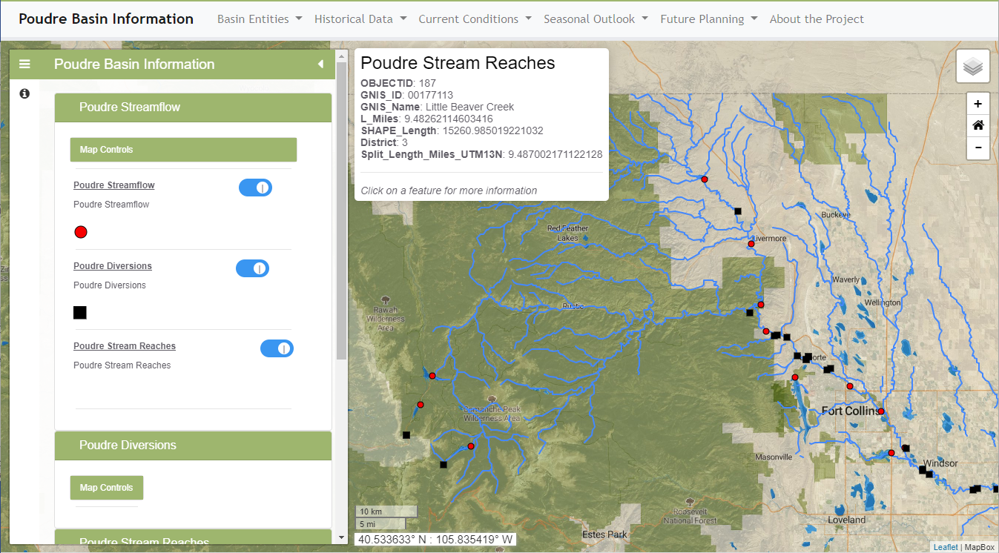

# InfoMapper #

This is the user documentation for the Open Water Foundation (OWF) InfoMapper software.
User documentation describes how to configure, deploy, and use the software.

* [Introduction](#introduction)
	* [InfoMapper Developers and Users](#infomapper-developers-and-users)
* [About the Open Water Foundation](#about-the-open-water-foundation)
* [How to Use this Documentation](#how-to-use-this-documentation)
* [Downloads](#downloads)
* [License](#license)
* [Source Repository on GitHub](#source-repository-on-github)

---------------

## Introduction ##

The InfoMapper software is a web application that displays text content pages,
maps, data visualizations, and other content.
It is being developed by the Open Water Foundation as a tool that can be
efficiently implemented to publish information products
generated by analysis software.
For example TSTool and GeoProcessor sofware (see OWF
[Software page](http://software.openwaterfoundation.org/))
can be used to automate creation of information products that published on the web
using InfoMapper.

The InfoMapper is particularly when fully automating the process of
creating information products and publishing to cloud web service storage solution and
Content Delivery Networks (CDNs).

The following image illustrates an example website.

**

**

**

InfoMapper Example Website (<a href="../images/InfoMapper-main.png">see full-size image</a>)

**

The InfoMapper software is typically used in parallel with one or more workflow projects that
automates information product generation.
The [OWF GeoProcessor](http://software.openwaterfoundation.org/geoprocessor/latest/doc-user/)
software has features to create map configuration files
that can be used by the InfoMapper.
See the following projects that are implementing this approach.

**

Projects with Workflows for InfoMapper

**

| **Published Project**&nbsp;&nbsp;&nbsp;&nbsp;&nbsp;&nbsp;&nbsp;&nbsp;&nbsp;&nbsp;&nbsp;&nbsp;&nbsp;&nbsp;&nbsp;&nbsp;&nbsp;&nbsp;&nbsp;&nbsp;&nbsp;&nbsp;&nbsp;&nbsp;&nbsp;&nbsp;&nbsp;&nbsp;&nbsp;&nbsp;&nbsp;&nbsp;&nbsp;&nbsp;&nbsp; | **Status** | **Description and Project Repository** |
| -- | -- | -- |
| [Poudre Basin Information](http://poudre.openwaterfoundation.org/latest/) | Under development | Information portal for Poudre River Basin in Colorado, intended to support the work of the [Poudre Runs Through It Study/Action Work Group](https://watercenter.colostate.edu/prti/), decision-makers, and serve as an information resource for the public.  Repository:  [owf-app-poudre-dashboard-workflow](https://github.com/OpenWaterFoundation/owf-app-poudre-dashboard-workflow) |
| [Upper Colorado Water Allocation Model](http://opencdss.openwaterfoundation.org/datasets/colorado/2015/) | Under development | Web application to publish the State of Colorado's StateMod water allocation model dataset.  It is envisioned that this will provide a way to publish StateMod datsets so that they are more accessible by interested parties.  Repository:  [cdss-app-statemod-web](https://github.com/OpenWaterFoundation/cdss-app-statemod-web) - **will be private until it reaches a critical mass of functionality** |

### InfoMapper Developers and Users ###

Currently, InfoMapper "users" are primarily software developers
who are adding features to InfoMapper software, in particular Open Water Foundation staff.
However, as the InfoMapper software matures,
a software installer will be provided for people that want to use the InfoMapper
but are not software developers.

This documentation focuses on those who are creating information products and public websites,
rather than InfoMapper software developers.
See the [InfoMapper Developer Documentation](http://software.openwaterfoundation.org/infomapper/latest/doc-dev/)
for software development information.

## About the Open Water Foundation ##

The [Open Water Foundation](http://openwaterfoundation.org) is a nonprofit social enterprise that focuses
on developing and supporting open source software for water resources,
to make better decisions about water.
OWF also works to advance open data tools and implementation.

See also the [Open Water Foundation website](http://openwaterfoundation.org).

## How to Use this Documentation ##

The documentation contains information about installing the software and using software features.
Of particular importance is the reference sections for configuration files.

Use the navigation menu provided on the left side of the page to navigate the documentation sections within the full document.
Use the navigation menu provided on the right side of the page to navigate the documentation sections with a page.
The navigation menus may not be displayed if the web browser window is narrow or if viewing on a mobile device,
in which case look for a menu icon to access the menus.
Use the search feature to find documentation matching the search words.

## Downloads ##

The InfoMapper software must currently be installed by cloning the following GitHub repository.
An installer will be added in the future.

* [owf-app-info-mapper-ng](https://github.com/OpenWaterFoundation/owf-app-info-mapper-ng) - GitHub repository

## License ##

The InfoMapper software is licensed using GPL v3.

The OWF InfoMapper documentation is licensed under the
[Creative Commons Attribution-NonCommercial-ShareAlike 4.0 International License](https://creativecommons.org/licenses/by-nc-sa/4.0).

## Source Repository on GitHub ##

The source files for this documentation are maintained in a GitHub repository:
[owf-app-info-mapper-ng-doc-user](https://github.com/OpenWaterFoundation/owf-app-info-mapper-ng-doc-user).
